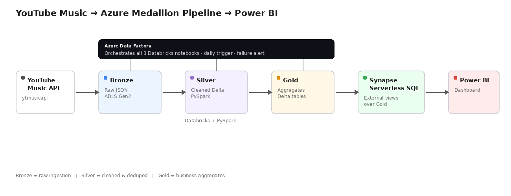

# YouTube Music — Azure Medallion Data Pipeline

A daily, fully orchestrated data pipeline that pulls music chart and artist data from YouTube Music, processes it through a Bronze → Silver → Gold medallion architecture on Azure, and serves it to Power BI for cross-regional trend and artist-growth analysis.



## Architecture

```
YouTube Music API (ytmusicapi)
        |
        v
  ADLS Gen2 - Bronze   (raw JSON: charts, artists, songs)
        |
        v   [Databricks + PySpark]
  ADLS Gen2 - Silver   (cleaned, deduped Delta tables)
        |
        v   [Databricks + PySpark]
  ADLS Gen2 - Gold     (business aggregates, Delta tables)
        |
        v
  Synapse Serverless SQL   (external views over Gold Delta tables)
        |
        v
  Power BI   (dashboard)
```

Orchestration: **Azure Data Factory** chains all three Databricks notebooks into one pipeline, triggered daily, with a failure alert wired to email.

## Business use case

- **Cross-regional chart comparison** — which artists are trending in which countries (IN, US, GB, BR, JP)
- **Artist growth tracking** — best rank, average rank, and number of countries an artist charts in
- **Recent output tracking** — which tracked artists have released songs in the last 5 years

## Tech stack

| Layer | Tools |
|---|---|
| Ingestion | Python, `ytmusicapi`, `azure-storage-file-datalake` |
| Storage | Azure Data Lake Storage Gen2 (Bronze / Silver / Gold) |
| Transformation | Azure Databricks, PySpark, Delta Lake (`deltalake` + `pyarrow`) |
| Orchestration | Azure Data Factory (linked service, job cluster, daily trigger, failure alert) |
| Serving | Azure Synapse Analytics — Serverless SQL Pool |
| Visualization | Power BI Desktop |

## Repo structure

```
notebooks/
├── 01_ingest_bronze.py       # API → Bronze (raw JSON)
├── 02_bronze_to_silver.py    # Bronze → Silver (cleaned Delta tables)
└── 03_silver_to_gold.py      # Silver → Gold (business aggregates)
sql/
└── synapse_gold_views.sql    # Synapse Serverless SQL view definitions
docs/
└── architecture.png          # ADF pipeline screenshot / diagram
```

## Setup

1. **Azure resources**: create a storage account (ADLS Gen2, with `bronze`/`silver`/`gold` containers), a Databricks workspace, an Azure Data Factory, and a Synapse Analytics workspace pointed at the same storage account.
2. **Notebooks**: upload the three files in `notebooks/` to Databricks. Replace the `storage_key` placeholder with a value from a Databricks secret scope (do not hardcode a real key).
3. **ADF**: create a linked service to Databricks (New Job Cluster mode), build one pipeline chaining the three notebooks as Notebook activities, and add a daily Schedule Trigger.
4. **Synapse**: run `sql/synapse_gold_views.sql` in a Synapse Serverless SQL script to create the `ytmusic_gold` database and its three views.
5. **Power BI**: connect via **Get Data → Azure Synapse Analytics SQL**, using the workspace's Serverless SQL endpoint and the `ytmusic_gold` database.

## Key engineering decisions

- **Delta Lake over plain Parquet** — ACID transactions, schema enforcement, and a transaction log (`_delta_log`) proving write history.
- **SDK-based I/O instead of Spark's native filesystem layer** — the Databricks workspace used here is Serverless-only, which blocks `spark.conf.set`/`dbutils.fs.put` storage credentials. Transformation logic still runs in real PySpark; only the ADLS read/write calls go through the `azure-storage-file-datalake` SDK.
- **Dynamic date partitioning** — every notebook computes `datetime.utcnow()` at runtime rather than hardcoding a date, so the daily trigger keeps working without manual edits.
- **New Job Cluster in ADF** — the workspace has no standing interactive cluster to reference, so ADF provisions and tears down its own cluster per run.

## Dashboard

Three Power BI visuals built on the Gold layer:
1. **Artists by global reach** — countries charted in, per artist
2. **Top 10 per country** — ranked table across all five tracked countries
3. **Recent output** — song counts from the last 5 years, per tracked artist

---

Built by [Nikhil](https://github.com/nikhilmanne10) · [LinkedIn](https://linkedin.com/in/nikhil-manne-0bb303220)
